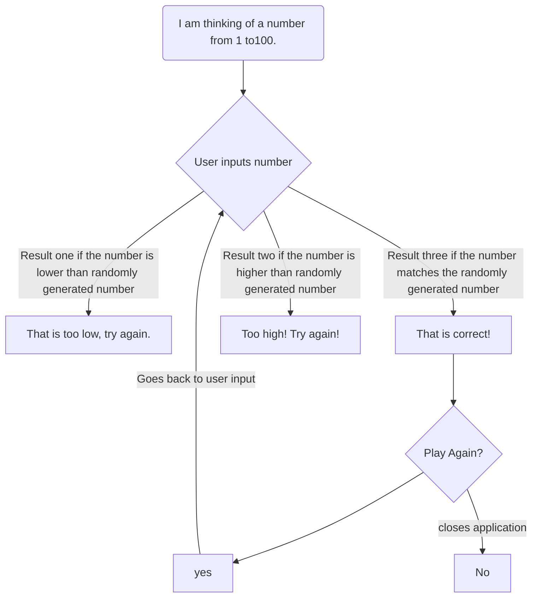

This flow chart layouts the process that my guessing game will go through. It will randomly generate a number 1 to 100. Next, it will ask the user to input a number 1 to 100 within given parameters and compare that number to the parameters in order to verify it is a valid entry. Then, it will compare the given number to the randomly selected number, if the two numbers match it will say correct and give you the option to play again. If the user input number does not match the randomly selected number, the program will tell the user if they were too high or too low.
